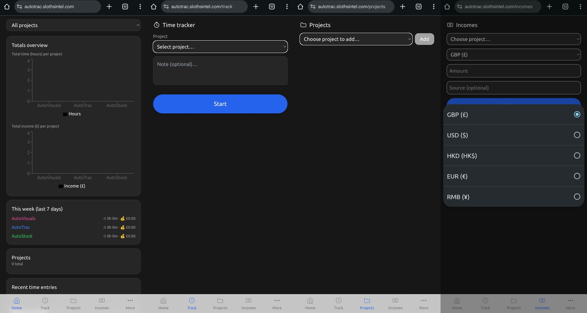
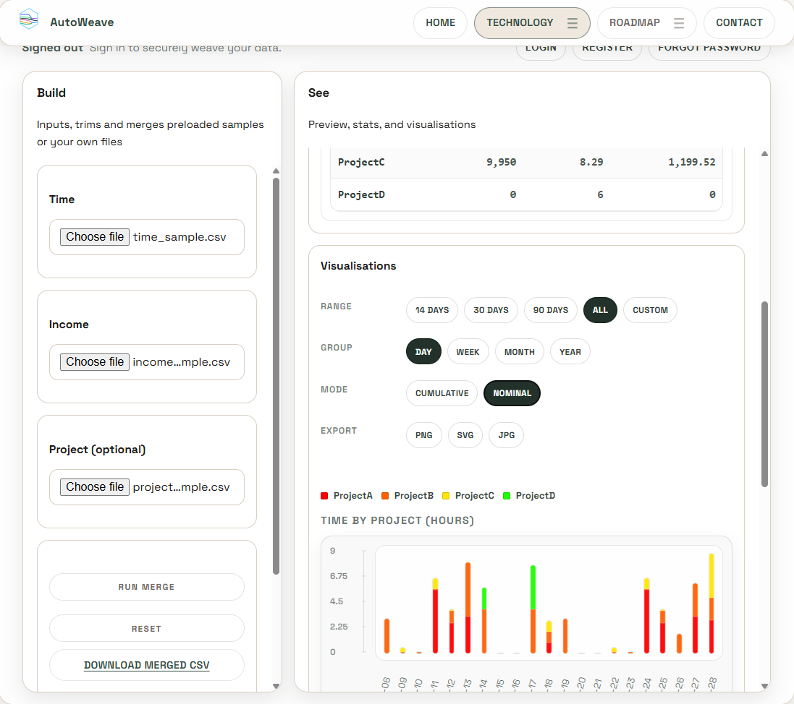

# Xi Lu PhD (aka daddy sloth)

Data Professional | AI Advisor | Hybrid Intelligence Engineer | [Chief Scientist & Founder](https://xilu.slothsintel.com/work.html#currentfocus) @[**Sloths Intel**](https://slothsintel.com/)

I build **deliberate data and AI systems** that turn messy real-world information into structured insight and practical decision support.

My work focuses on [**Hybrid Intelligence**](https://slothsintel.com/index.html#approach) - ystems where data pipelines, machine learning, domain expertise, and human judgement work together to produce results that remain reliable under real-world complexity.

Rather than pursuing abstract artificial intelligence, I focus on **applied intelligence systems** that help individuals and small organisations understand their data and make better decisions.

## Current Focus

My current work focuses on developing practical tools and research prototypes through [**Sloths Intel**](https://slothsintel.com/), exploring how **Hybrid Intelligence** systems can support everyday decision making.

Key directions include:

• **Hybrid Intelligence** systems for real-world decision support  
• data integration and curation from fragmented sources  
• applied analytics for freelancers and small organisations  
• automation pipelines that transform raw data into insight  
• human-AI collaboration rather than full automation

Much of this work sits between **research and engineering** - building systems that are both conceptually sound and practically useful.

## Philosophy

Sloths are often misunderstood for slow.

In reality, they are **efficient and deliberate** - evolved to operate in complex environments with minimal waste.

[**Sloths Intel**](https://slothsintel.com/) adopts the same philosophy: build systems that avoid noise, conserve effort, and produce **clear, reliable decisions when they matter**.

## Open Projects

Together these projects form the Sloths Intel Hybrid Intelligence stack for data capture, integration, prediction, and automation. *Find the full list of products and details at* [*Sloths Intel Products Hub*](https://slothsintel.com/products.html).

### [AutoTrac](https://github.com/slothsintel/AutoTrac)
**Analytics platform for understanding how time and income actually flow.**       

AutoTrac is a lightweight analytics platform designed for freelancers and small teams to analyse time usage, project activity, and income patterns.

  

Technologies  
TypeScript | analytics pipelines | web tools | Python

### [AutoWeave](https://github.com/slothsintel/AutoWeave)
 
**Predictive modelling for practical decision support.**

AutoWeave explores hybrid approaches to data integration and curation, helping users merge multiple datasets into coherent analytical structures.

Technologies  
JavaScript | data processing | visualisation | Python

### [AutoPred](https://github.com/slothsintel/AutoPred)
Predictive modelling for decision support.

AutoPred explores practical predictive analytics built on top of structured datasets.  
The project focuses on lightweight forecasting models that help small organisations and local businesses anticipate trends, demand, and operational outcomes.

Technologies  
Python | Bayesian modelling | statistical learning | data pipelines

Status  
Experimental research project

### [AutoVisuals](https://github.com/slothsintel/AutoVisuals)
 
**Automation pipelines for generative visual workflows.**

AutoVisuals is an experimental pipeline designed to automate the generation, processing, and organisation of visual assets through AI-assisted workflows.

Technologies  
Python | generative workflows | image processing | AI image

## Useful Links

[Personal site](https://xilu.slothsintel.com) |
[Sloths Intel site](https://slothsintel.com) |
[Sloths Intel GitHub](https://github.com/slothsintel)

## Research Interests

Hybrid Intelligence |
Applied data systems |
Decision-support architectures |
Human-AI collaboration |
Responsible AI deployment